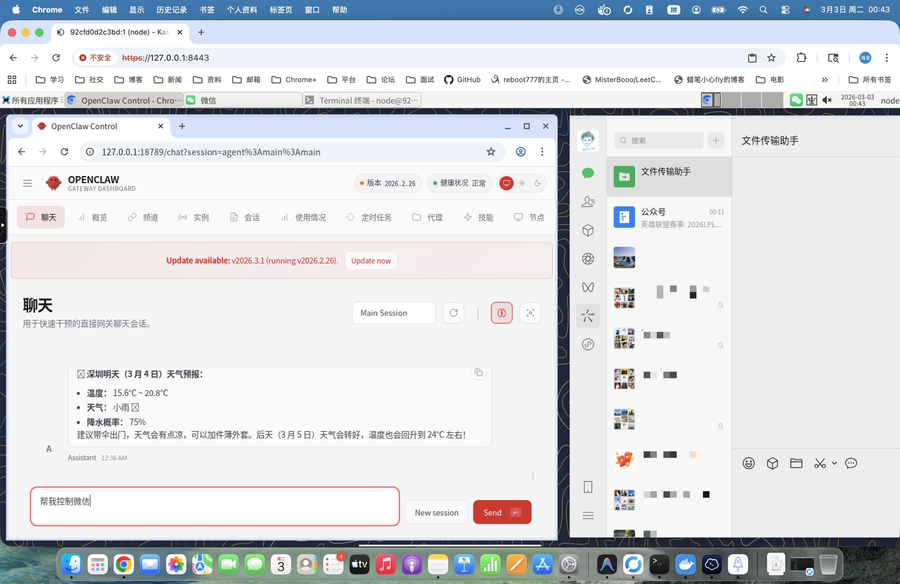

# openclaw-kasmvnc

One-click deployment for OpenClaw + KasmVNC (Windows / macOS / Linux).

> 🇨🇳 中文版 / Chinese version: [README-zh.md](README-zh.md)



## Key Advantages

### 🔧 Full Lifecycle Management Inside Container

**Solves the core limitation of official OpenClaw Docker deployment:**

In the official OpenClaw Docker setup, the Gateway runs on the host machine, and containers lack systemd, causing:
- ❌ Cannot run `openclaw gateway restart` inside container
- ❌ Cannot run `npm install -g openclaw@latest` for hot updates inside container
- ❌ Must manually restart container after config changes

**This project solves it with systemctl shim:**
- ✅ Supports `openclaw gateway restart` inside container
- ✅ Supports `upgrade` command for hot updates (no image rebuild needed)
- ✅ Complete `install / upgrade / restart / uninstall` lifecycle management

### 👁️ Visual Desktop Environment

**Solves the visibility problem of cloud vendor one-click deployments:**

Cloud vendor OpenClaw deployments typically only provide CLI, making it impossible to:
- ❌ Watch OpenClaw operate the browser in real-time
- ❌ Observe Agent task execution with visual feedback
- ❌ Debug desktop application issues

**This project provides a complete desktop environment:**
- ✅ Browser-based XFCE desktop (KasmVNC)
- ✅ Watch OpenClaw operate Chromium in real-time
- ✅ Full Linux desktop experience

## Quick Start

Windows:
```powershell
irm https://raw.githubusercontent.com/ddong8/openclaw-kasmvnc/main/openclaw-kasmvnc.ps1 | iex
```

macOS / Linux:
```bash
curl -fsSL https://raw.githubusercontent.com/ddong8/openclaw-kasmvnc/main/openclaw-kasmvnc.sh | bash -s -- install
```

After install:

| Service | URL | Credentials |
|---------|-----|-------------|
| WebChat | `http://127.0.0.1:18789/chat?session=main` | `OPENCLAW_GATEWAY_TOKEN` |
| KasmVNC Desktop | `https://127.0.0.1:8443` | User `node`, password `OPENCLAW_KASMVNC_PASSWORD` |

> Token and password are auto-generated on first install. Save them somewhere safe.

## Other Features

- **Environment isolation** -- OpenClaw, desktop, and all dependencies live inside the container
- **One-click deploy** -- install, upgrade, and restart via a single script + Compose
- **Cross-platform** -- identical container behavior on Windows, macOS, and Linux
- **Docker-in-Docker** -- built-in dockerd lets OpenClaw create and manage child containers
- **GPU auto-detect** -- automatically enables `nvidia` runtime when a host GPU is present
- **Mass deployment** -- standardized container approach enables large-scale lobster deployments

## Prerequisites

- Docker (with Docker Compose v2)
- Windows: PowerShell 5+ / 7+
- macOS / Linux: Bash

## Common Commands

<details>
<summary><b>Windows (PowerShell)</b></summary>

```powershell
# Install
powershell -ExecutionPolicy Bypass -File .\openclaw-kasmvnc.ps1 -Command install

# Uninstall (stop services only)
powershell -ExecutionPolicy Bypass -File .\openclaw-kasmvnc.ps1 -Command uninstall

# Uninstall and remove install directory
powershell -ExecutionPolicy Bypass -File .\openclaw-kasmvnc.ps1 -Command uninstall -Purge

# Restart
powershell -ExecutionPolicy Bypass -File .\openclaw-kasmvnc.ps1 -Command restart

# Upgrade
powershell -ExecutionPolicy Bypass -File .\openclaw-kasmvnc.ps1 -Command upgrade

# Status / Logs
powershell -ExecutionPolicy Bypass -File .\openclaw-kasmvnc.ps1 -Command status
powershell -ExecutionPolicy Bypass -File .\openclaw-kasmvnc.ps1 -Command logs -Tail 200
```

</details>

<details>
<summary><b>macOS / Linux (Bash)</b></summary>

```bash
chmod +x ./openclaw-kasmvnc.sh

./openclaw-kasmvnc.sh install              # Install
./openclaw-kasmvnc.sh uninstall            # Uninstall (stop services only)
./openclaw-kasmvnc.sh uninstall --purge    # Uninstall and remove install directory
./openclaw-kasmvnc.sh restart              # Restart
./openclaw-kasmvnc.sh upgrade              # Upgrade
./openclaw-kasmvnc.sh status               # Status
./openclaw-kasmvnc.sh logs --tail 200      # Logs
```

</details>

## Optional Parameters

| Parameter | Windows (PS1) | macOS/Linux (sh) | Default |
|-----------|---------------|-------------------|---------|
| Install directory | `-InstallDir` | `--install-dir` | `$HOME/openclaw-kasmvnc` |
| Gateway port | `-GatewayPort` | `--gateway-port` | `18789` |
| VNC HTTPS port | `-HttpsPort` | `--https-port` | `8443` |
| Gateway token | `-GatewayToken` | `--gateway-token` | Auto-generated |
| VNC password | `-KasmPassword` | `--kasm-password` | Auto-generated |
| HTTP proxy | `-Proxy` | `--proxy` | None |
| Disable Docker-in-Docker | `-NoDinD` | `--no-dind` | No |
| Log lines | `-Tail` | `--tail` | `200` |
| Purge install dir | `-Purge` | `--purge` | No |

> The script fetches the `latest` OpenClaw version via npm. Run `upgrade` to update.

<details>
<summary>Custom install examples</summary>

```powershell
# Windows
powershell -ExecutionPolicy Bypass -File .\openclaw-kasmvnc.ps1 `
  -Command install `
  -InstallDir "D:\openclaw-deploy" `
  -GatewayPort "18789" `
  -HttpsPort "8443"
```

```bash
# macOS/Linux
./openclaw-kasmvnc.sh install \
  --install-dir "$HOME/openclaw-deploy" \
  --gateway-port 18789 \
  --https-port 8443
```

</details>

<details>
<summary>Using a proxy</summary>

Pass `--proxy` at install time to route all container HTTP/HTTPS traffic through a proxy:

```bash
# Linux/macOS
./openclaw-kasmvnc.sh install --proxy http://192.168.1.131:10808

# Windows
powershell -ExecutionPolicy Bypass -File .\openclaw-kasmvnc.ps1 -Command install -Proxy "http://192.168.1.131:10808"
```

You can also edit `.env` after install and `restart` to apply:
```env
OPENCLAW_HTTP_PROXY=http://192.168.1.131:10808
```

</details>

<details>
<summary>Disable Docker-in-Docker (more secure)</summary>

By default, the container installs Docker CE and runs in privileged mode to support Docker-in-Docker. If you don't need OpenClaw to manage child containers, you can disable DinD for better security:

```bash
# Linux/macOS
./openclaw-kasmvnc.sh install --no-dind

# Windows
powershell -ExecutionPolicy Bypass -File .\openclaw-kasmvnc.ps1 -Command install -NoDinD
```

When `--no-dind` is enabled:
- Docker CE is not installed in the container
- Container runs without `privileged: true` (more secure)
- OpenClaw cannot create or manage child containers

</details>

<details>
<summary>KasmVNC version selection</summary>

Default is KasmVNC **1.3.0**. Override via environment variable:

```bash
# Linux/macOS
OPENCLAW_KASMVNC_VERSION=1.4.0 ./openclaw-kasmvnc.sh install

# Windows
$env:OPENCLAW_KASMVNC_VERSION="1.4.0"
powershell -ExecutionPolicy Bypass -File .\openclaw-kasmvnc.ps1 -Command install
```

</details>

## Project Structure

- `openclaw-kasmvnc.sh` -- macOS/Linux script (international)
- `openclaw-kasmvnc.ps1` -- Windows script (international)
- `openclaw-kasmvnc-zh.sh` -- macOS/Linux script (Chinese, with China-optimized mirrors)
- `openclaw-kasmvnc-zh.ps1` -- Windows script (Chinese, with China-optimized mirrors)

After running, the install directory contains:
```
<install-dir>/
├── .env                              # Environment config (token, password, ports)
├── .openclaw/                        # OpenClaw persistent config and workspace
├── docker-compose.yml                # Compose service definition
├── Dockerfile.kasmvnc                # Image build (node:22 + KasmVNC + XFCE)
└── scripts/docker/
    ├── kasmvnc-startup.sh            # Container entrypoint (VNC → desktop → gateway)
    └── systemctl-shim.sh             # systemctl shim (translates systemd calls to signals)
```

## Built-in Features

- **UTC timezone, en_US locale** -- `TZ=UTC`, `LANG=en_US.UTF-8`, Noto fonts pre-installed
- **Gateway auto-restart** -- supervisor loop restarts the gateway on crash; VNC session stays connected
- **X11 cleanup** -- entrypoint clears stale X11 lock files and VNC processes to prevent black screens
- **systemctl shim** -- no systemd in the container; the shim makes `openclaw gateway restart/stop/start` work
- **Clipboard safety** -- removes the default `chromium/x-web-custom-data` MIME type so `pkill -f chromium` won't kill VNC

<details>
<summary>Managing the gateway inside the container</summary>

Open a terminal in the VNC desktop and use standard OpenClaw commands:

```bash
openclaw gateway restart          # Restart (reload latest code)
openclaw gateway stop             # Stop
openclaw gateway status --probe   # Check status
```

> These commands work via the built-in systemctl shim -- no real systemd required.

</details>

## Configuration Changes

Config files: `<install-dir>/openclaw/.env`, `<install-dir>/openclaw/.openclaw/openclaw.json`

1. Edit the config file
2. Run `restart`
3. Verify with `status` and `logs --tail 200`

> If you changed image-level config (Dockerfile, system packages), run `upgrade` instead of `restart`.

## Known Issues

### VNC flicker during `openclaw update`

`npm install` causes high CPU/IO, which may trigger KasmVNC WebSocket heartbeat timeouts. This is temporary resource contention -- the session recovers automatically. Run `upgrade` when the host has spare resources.

## FAQ

### 1. Port conflict

Change ports at install time: Windows `-GatewayPort 28789 -HttpsPort 9443`, macOS/Linux `--gateway-port 28789 --https-port 9443`, then re-run `install`.

### 2. HTTPS certificate warning

KasmVNC uses a self-signed certificate by default. Click through the browser warning, or set up a reverse proxy (Nginx / Caddy) with a real cert.

### 3. Black screen after entering desktop

Try in order: `restart` → `status` → `logs --tail 200` → `upgrade`.

### 4. Container restart loop

Common causes: missing `.env` parameters, directory permission issues, port conflicts. Re-run `install` or change ports.

### 5. macOS `chown: Operation not permitted`

This warning may appear on Apple Silicon Macs for certain mount paths. If the container runs fine, it can be safely ignored.

### 6. Why Chromium instead of Chrome?

1. **Multi-arch** -- Google does not ship ARM64 Chrome; Chromium supports both x86_64 and arm64
2. **License** -- Chrome includes proprietary components (DRM, etc.) unsuitable for public images
3. **Clean dependencies** -- `apt install chromium` integrates cleanly with system libraries

### 7. Too many logs

Use `logs --tail 200` for recent output, `logs --tail 50` to quickly spot errors.

## Star History

[](https://star-history.com/#ddong8/openclaw-kasmvnc&Date)

## License

[MIT](LICENSE)
